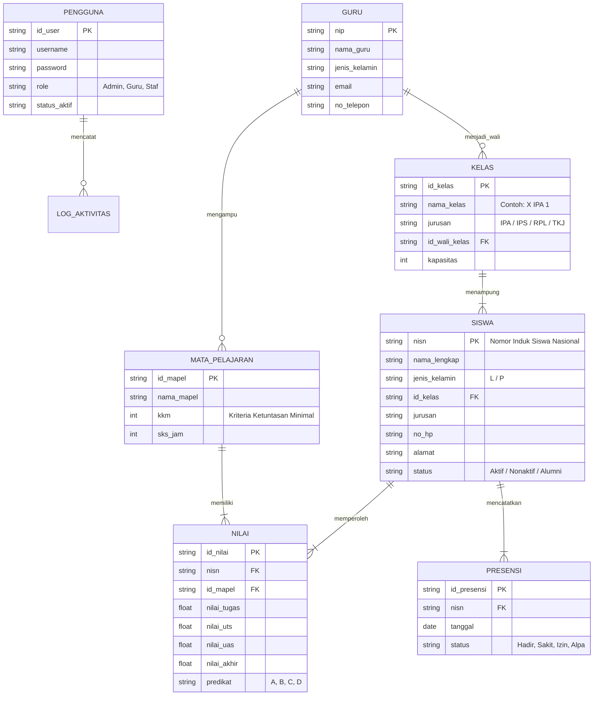
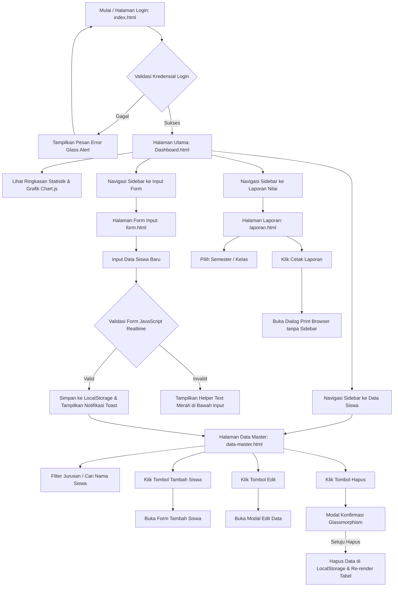
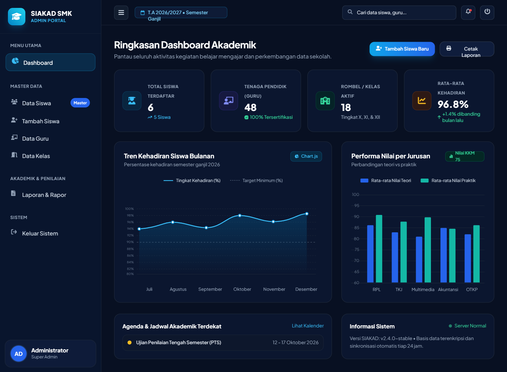
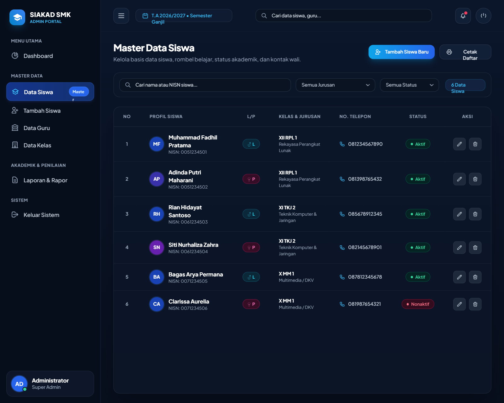

# PERANCANGAN SISTEM INFORMASI AKADEMIK SEKOLAH (SIAKAD)
**Mata Kuliah:** Pemrograman Web 2 (Client-Side Programming)  
**Topik:** Nomor 3 - Sistem Informasi Akademik Sekolah (SIAKAD)  
**Tema Estetika UI:** Glassmorphism Modern  
**Milestone:** Milestone 1 (Perencanaan Menu, ER-D Mermaid, & UI Wireframing)

---

## 1. Pendahuluan & Latar Belakang

Sistem Informasi Akademik Sekolah (SIAKAD) merupakan aplikasi web back-office (Admin Panel) yang dirancang untuk mempermudah tata kelola data akademik di lingkungan sekolah menengah (SMA/SMK). Sistem ini memfasilitasi administrasi data pokok pendidikan mulai dari data siswa, tenaga pendidik (guru), mata pelajaran, rombongan belajar (kelas), hingga perekapan nilai rapor dan presensi siswa.

Proyek ini dibangun menggunakan paradigma **Client-Side Programming murni** (HTML5, CSS3, dan Vanilla JavaScript) dengan penyimpanan sementara berbasis browser (`LocalStorage`) tanpa ketergantungan server database back-end.

---

## 2. Tema Visual UI: Glassmorphism Modern

Tema visual yang diimplementasikan adalah **Glassmorphism**, yang menonjolkan:
- **Transparansi & Kedalaman (*Depth*):** Penggunaan warna semi-transparan (`rgba`) dipadukan dengan efek `backdrop-filter: blur()`.
- **Border Halus Bertransisi (*Subtle Borders*):** Garis tepi putih transparan (`1px solid rgba(255, 255, 255, 0.15)`) yang menyerupai pantulan cahaya pada lempengan kaca tipis.
- **Warna Latar Gradasi Elegan:** Background gradasi radial & linier gelap-ke-aksen (Deep Navy `#0B132B`, Indigo `#1C2541`, dan aksen Cyan/Emerald `#06D6A0` & `#4CC9F0`).
- **Pencahayaan & Efek Glow:** Elemen dekoratif *blurred glowing orbs* di latar belakang untuk menonjolkan efek blur kaca ketika komponen digulir (*scroll*).

---

## 3. Design System & Style Guide

### 3.1 Color Palette
| Peran Warna | Nama Token | Kode HEX / RGBA | Penggunaan |
| :--- | :--- | :--- | :--- |
| **Primary Background** | `--bg-gradient` | `linear-gradient(135deg, #0B132B 0%, #1C2541 50%, #111827 100%)` | Latar utama dashboard |
| **Glass Surface** | `--glass-bg` | `rgba(255, 255, 255, 0.07)` | Panel kartu, sidebar, dan header |
| **Glass Border** | `--glass-border` | `rgba(255, 255, 255, 0.15)` | Garis tepi komponen kaca |
| **Primary Accent** | `--accent-primary` | `#4CC9F0` | Aksen tombol aktif, link, highlight chart |
| **Secondary Accent** | `--accent-success` | `#06D6A0` | Status aktif, nilai tuntas, tombol sukses |
| **Warning Accent** | `--accent-warning` | `#FFD166` | Peringatan, status menunggu validasi |
| **Danger Accent** | `--accent-danger` | `#EF476F` | Tombol hapus, nilai remedial, modal konfirmasi |
| **Text Primary** | `--text-main` | `#F8FAFC` | Judul, heading, teks utama |
| **Text Muted** | `--text-muted` | `#94A3B8` | Label input, deskripsi pembantu |

### 3.2 Typography Styles
- **Font Utama:** `Plus Jakarta Sans` / `Inter`, sans-serif.
- **Heading 1 (Dashboard Title):** 28px, Bold (700), Line-height 1.2.
- **Heading 2 (Section / Card Title):** 18px, Semi-Bold (600).
- **Body Text:** 14px, Regular (400), Line-height 1.5.
- **Caption & Meta Data:** 12px, Medium (500).

### 3.3 Reusable Components
1. **Glass Card (`.glass-card`):** Kartu berlatar blur kaca dengan padding 24px dan radius 16px.
2. **Button Variants:**
   - `.btn-primary`: Latar gradasi Cyan ke Biru dengan efek hover glow.
   - `.btn-secondary`: Latar semi-transparan dengan border kaca.
   - `.btn-danger`: Aksen merah muda menyala untuk aksi destruktif.
3. **Form Input (`.glass-input`):** Input field transparan dengan border kaca yang bertransisi ke border Cyan menyala saat focus.
4. **Data Badge (`.badge-success`, `.badge-warning`, `.badge-danger`):** Penanda status siswa dan absensi.

---

## 4. Hirarki Struktur Menu Navigasi

SIAKAD Admin Panel memiliki navigasi berbasis **Collapsible Sidebar** dan **Top Navigation Bar**:

```
[SIAKAD Admin Panel]
├── Topbar / Header
│   ├── Toggle Button (Buka/Tutup Sidebar Responsif)
│   ├── Search Bar Cepat (Global Search)
│   ├── Indikator Tahun Ajaran & Semester (2026/2027 Ganjil)
│   ├── Notifikasi Dropdown (Badge 3 notifikasi)
│   └── User Profile Card (Admin Utama & Menu Logout)
│
└── Sidebar Menu
    ├── 1. MENU UTAMA
    │   └── Dashboard (/pages/dashboard.html)
    │       ├── Ringkasan Statistik (Siswa, Guru, Kelas, Rata-rata Nilai)
    │       ├── Grafik Kehadiran Siswa (Line Chart)
    │       ├── Grafik Distribusi Nilai per Jurusan (Bar Chart)
    │       └── Aktivitas & Pengumuman Akademik Terkini
    │
    ├── 2. MASTER DATA
    │   ├── Data Siswa (/pages/data-master.html)
    │   │   ├── Tabel Data Siswa (NISN, Nama, Kelas, Jurusan, Status)
    │   │   ├── Filter Jurusan & Kelas
    │   │   ├── Pencarian Real-Time
    │   │   └── Aksi: Tambah Modal, Edit Modal, & Hapus Modal
    │   ├── Tambah / Edit Siswa (/pages/form.html)
    │   │   ├── Form Input Lengkap Siswa
    │   │   └── Validasi Real-time JavaScript
    │   ├── Data Guru (Mock Menu)
    │   ├── Data Kelas & Rombel (Mock Menu)
    │   └── Data Mata Pelajaran (Mock Menu)
    │
    ├── 3. AKADEMIK & PENILAIAN
    │   ├── Laporan Nilai & Rapor (/pages/laporan.html)
    │   │   ├── Rekapitulasi Rapor Siswa
    │   │   ├── Filter Semester & Tahun Akademik
    │   │   └── Fitur Cetak Langsung (Print Ready CSS)
    │   └── Jadwal Pelajaran (Mock Menu)
    │
    └── 4. SISTEM & PENGATURAN
        ├── Pengaturan Profil Sekolah
        └── Keluar / Logout (Redirect ke /index.html)
```

---

## 5. Konsep ER-D Sederhana (Entity Relationship Diagram)

Berikut rancangan relasi data entitas utama SIAKAD yang dimodelkan dalam sintaks **Mermaid.js**:



---

## 6. User Flow Antarmuka Admin Panel

Berikut alur pengalaman pengguna (User Flow) dalam mengoperasikan Admin Panel SIAKAD:



---

## 7. UI Wireframing & Prototyping Blueprint

### 7.1 Hasil Wireframing & Blueprint Stitch by Google
Dalam perancangan komponen cepat menggunakan **Stitch by Google**, dihasilkan 2 rancangan antarmuka utama (*High-Res Wireframe Components*):

#### 1. Wireframe Dashboard Admin SIAKAD (Stitch by Google)


#### 2. Wireframe Data Master Siswa (Stitch by Google)


### 7.2 Spesifikasi Komponen & Tautan Figma
- **Tautan Publik Proyek Figma:** [SIAKAD Admin Panel - Glassmorphism (Figma)](https://www.figma.com/design/1m2uvnXPlMs9yNn5Uq1sCQ/SIAKAD-Admin-Panel---Glassmorphism?node-id=0-1&t=Uz29EOKYCexw0Xkr-1)
- **URL Lengkap:** `https://www.figma.com/design/1m2uvnXPlMs9yNn5Uq1sCQ/SIAKAD-Admin-Panel---Glassmorphism?node-id=0-1&t=Uz29EOKYCexw0Xkr-1`
- **Frame 1:** `Desktop - Dashboard 1440x1024` (Menampilkan statistik, chart grafik, dan kalender kegiatan).
- **Frame 2:** `Desktop - Data Master Siswa 1440x1024` (Menampilkan data tabel lengkap dengan filter dan pagination).
- **Frame 3:** `Desktop - Form Tambah Siswa 1440x1024` (Form 2 kolom dengan validasi visual).
- **Frame 4:** `Mobile - Responsive Drawer 375x812` (Tampilan drawer sidebar pada layar smartphone).

---

## 8. Rencana Implementasi Client-Side
- **Library Grafik:** `Chart.js` (Integrasi via CDN responsif).
- **Icon Pack:** `FontAwesome 6` / `Bootstrap Icons` (Menghadirkan ikon navigasi modern dan informatif).
- **State Management Data:** `Window.localStorage` dengan key `siakad_students` untuk menyimpan mutasi data tambah, edit, dan hapus secara persisten di browser.
- **Pencetakan Dokumen:** Pure CSS Print Stylesheet (`@media print`) untuk menghasilkan layout lembar cetak resmi tanpa header/sidebar.
